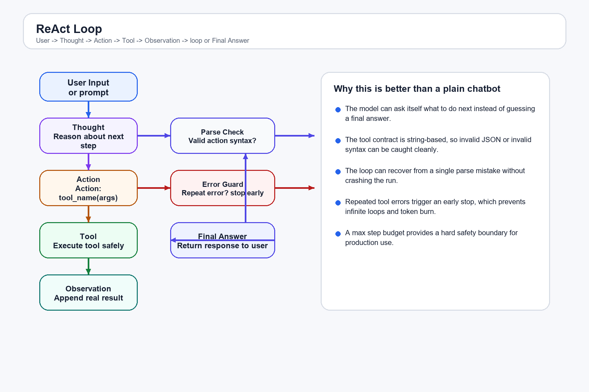
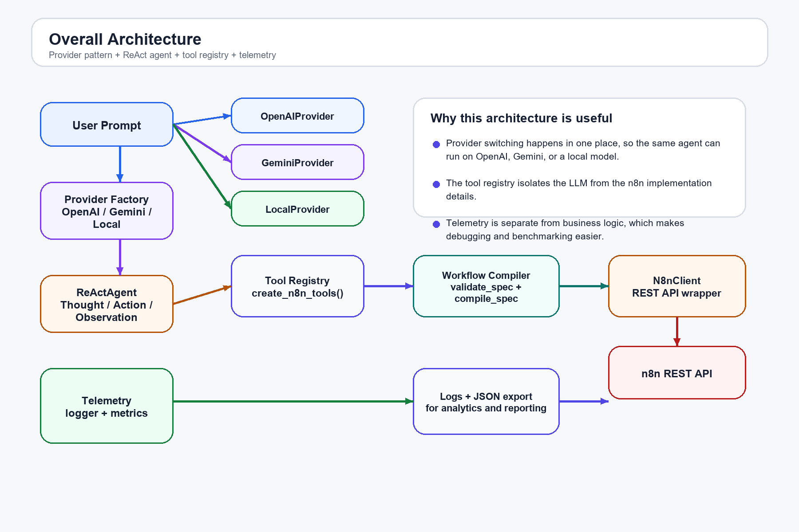

# Flowchart & Use Case Traces

## Visual Assets

The PNG files above are the canonical diagrams for the report.

## Use Case Files

Detailed scenarios are split into separate markdown files:

- [Use Case Index](usecases/README.md)
- [Simple Answer](usecases/uc01_simple_answer.md)
- [Multi-Step Workflow](usecases/uc02_multi_step_workflow.md)
- [Parse Error Recovery](usecases/uc03_parse_error.md)
- [Repeated Tool Error Guardrail](usecases/uc04_repeated_tool_error.md)
- [Max Steps Exhaustion](usecases/uc05_max_steps.md)
- [Provider Switching](usecases/uc06_provider_switching.md)
- [Metrics Export](usecases/uc07_metrics_export.md)
- [Activation Failure](usecases/uc08_activation_failure.md)

## Appendix Files

- [Tool Inventory](appendix/tool_inventory.md)
- [Telemetry Dashboard](appendix/telemetry_dashboard.md)
- [Ablation Studies](appendix/ablation_studies.md)
- [Production Readiness](appendix/production_readiness.md)
- [Provider Switching Summary](appendix/provider_switching.md)
