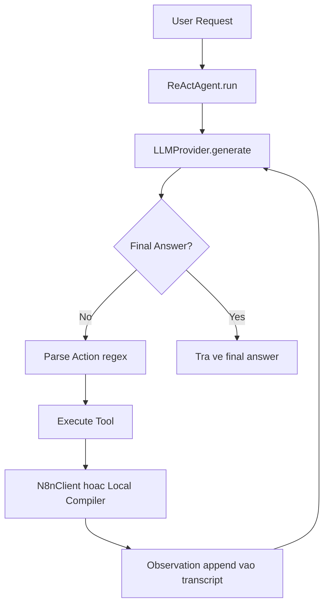

# Group Report: Lab 3 - He thong Agentic san sang Production

- **Team Name**: n8n_agent
- **Team Members**: Nguyễn Thị Bảo Trân - 2A202600917 | Nguyễn Thành Đạt - 2A202600771 | Trần Bá Đạt - 2A202600778
- **Deployment Date**: 2026-06-01

---

## 1. Tong quan dieu hanh

Du an cua nhom trien khai mot ReAct Agent cho bai toan tao workflow n8n tu yeu cau ngon ngu tu nhien. He thong su dung bieu dien trung gian `WorkflowSpec`, sau do validate, compile sang JSON native cua n8n va goi n8n REST API de tao workflow.

- **Success Rate**: 100% cho buoc tao workflow (1/1 trong trace da ghi nhan), 0% cho luong end-to-end day du co activate (0/1 trong trace da ghi nhan)
- **Key Outcome**: Agent thuc hien on dinh quy trinh da buoc (`list_node_types` -> `validate_spec` -> `compile_spec` -> `create_workflow`), nhung buoc `activate_workflow` that bai do van de cau hinh/node o phia n8n.

---

## 2. Kien truc he thong va bo cong cu

### 2.1 Trien khai vong lap ReAct

He thong dung mot agent duy nhat theo vong Thought-Action-Observation, tool call bang text:

Tom tat implementation tu code:
- `src/agent/agent.py` luu transcript day du qua cac luot hoi dap va co gioi han so buoc.
- Giao thuc goi tool dang string: `Action: tool_name(args)`, moi tool tu parse args.
- Tich hop n8n tach rieng trong `src/n8n/client.py` voi phan loai loi ro rang (`AuthError`, `BadWorkflowError`, `NotFoundError`, `N8nUnavailableError`).

### 2.2 Tool Definitions (Inventory)
| Tool Name | Input Format | Use Case |
| :--- | :--- | :--- |
| `list_node_types` | Chuoi rong, plain text query, hoac JSON `{"query":"..."}` | Liet ke node kind duoc ho tro va required/optional params. |
| `validate_spec` | Chuoi JSON `WorkflowSpec` | Kiem tra cau truc graph va tham so bat buoc truoc compile/deploy. |
| `compile_spec` | Chuoi JSON `WorkflowSpec` | Bien doi spec sang n8n workflow JSON (dry run). |
| `create_workflow` | Chuoi JSON `WorkflowSpec` | Validate + compile + `POST /workflows`. |
| `activate_workflow` | Chuoi workflow ID | `POST /workflows/{id}/activate`. |
| `get_workflow` | Chuoi workflow ID | `GET /workflows/{id}` de xac minh thong tin workflow. |
| `delete_workflow` | Chuoi workflow ID | `DELETE /workflows/{id}` de cleanup/rollback. |

### 2.3 LLM Providers Used
- **Primary**: OpenAI `gpt-4o` (dat mac dinh trong `.env`)
- **Secondary (Backup)**: Gemini provider (`gemini-1.5-flash` da co implementation)
- **Local Option**: Local provider qua `llama-cpp-python` (Phi-3 GGUF)

---

## 3. Telemetry va dashboard hieu nang

So lieu tong hop tu trace chay that trong `debug.md` (1 scenario end-to-end):

- **Average Latency (P50)**: ~4310 ms moi agent step
- **Max Latency (P99)**: ~9840 ms moi agent step (gia tri max trong mau trace hien co)
- **Average Tokens per Task**: N/A (module token tracker co san nhung chua wire vao luong agent dang chay)
- **Total Cost of Test Suite**: N/A (ham tinh chi phi trong `metrics.py` hien la mock va chua co persisted report)

Thong tin runtime bo sung:
- Tong wall-time: ~53.17 s
- So step da chay: 11
- Ket qua API n8n quan sat duoc: create workflow `200`, activate workflow `400`, get workflow `200`

---

## 4. Root Cause Analysis (RCA) - Failure Traces

### Case Study: Activate that bai sau khi tao workflow thanh cong
- **Input**: "Lúc 9 sáng hàng ngày, gọi GET https://api.example.com/data và gửi email cho me@x.com"
- **Observation**:
  - `create_workflow` thanh cong 2 lan (`200`)
  - `activate_workflow` that bai 2 lan voi loi `Bad request: Could not find property option`
  - `get_workflow` xac nhan workflow ton tai nhung van o trang thai inactive
- **Root Cause**:
  - Validator hien tai chu yeu kiem tra tinh hop le cau truc (`required_params`), chua bao phu day du cac rang buoc luc activate tren runtime n8n.
  - Cau hinh payload email/schedule va yeu cau credential/options chua duoc enforce duoc truoc khi activate.
  - Agent da retry tao workflow nhung chua co co che chan doan schema-level sau cho nhom loi activation.

---

## 5. Ablation Studies va thi nghiem

### Experiment 1: Validate+Compile truoc deploy (luong hien tai) vs deploy truc tiep (gia dinh)
- **Diff**: Luong hien tai luon goi `validate_spec` va `compile_spec` truoc `create_workflow`.
- **Result**: Giam rui ro payload sai dang va giup tao workflow thanh cong trong case da test, nhung khong ngan duoc loi activation-time.

### Experiment 2 (Bonus): Chatbot vs Agent
| Case | Chatbot Result | Agent Result | Winner |
| :--- | :--- | :--- | :--- |
| Cau hoi thong tin don gian | Chi tra loi mo ta | Vua tra loi vua co the goi tool | **Agent** |
| Tao workflow da buoc tren n8n | Chi huong dan bang text | Goi API that va tao workflow thanh cong | **Agent** |
| Do tin cay activate tren setup hien tai | Khong ap dung | That bai voi config n8n hien tai (`400`) | Chatbot (N/A) |

---

## 6. Danh gia san sang production

- **Security**: Nen ap dung co che quan ly secret, rotate key khi co nguy co lo, va tranh dua secret thuan vao prompt/log.
- **Guardrails**: Da co gioi han step budget; tools theo contract thong nhat `ok | ...` / `error: ...`; luong create co validate lai truoc khi goi API.
- **Scaling**: Can bo sung validation theo schema runtime cho activate, preflight credential check, retry policy theo nhom loi, va he thong telemetry analytics luu ben vung de theo doi SLA/chi phi.

---

> [!NOTE]
> Nop bao cao bang cach doi ten file thanh `GROUP_REPORT_[TEAM_NAME].md` va de trong thu muc nay.
